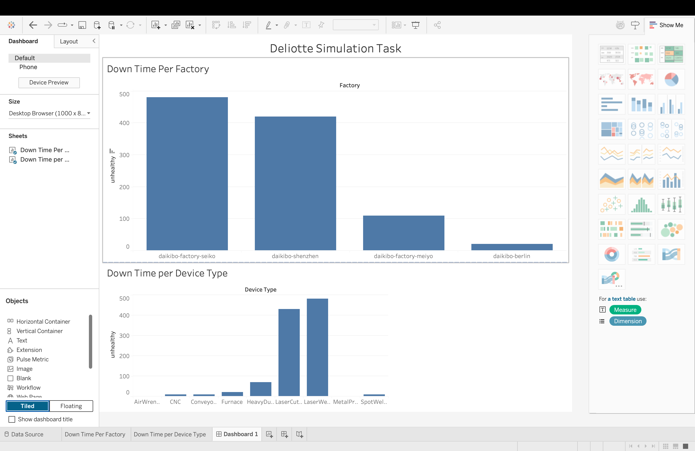

# 🏭 Deloitte Australia Simulation: Factory Machinery Telemetry

> Machinery telemetry log analysis and interactive Tableau dashboard to pinpoint operational downtime across manufacturing sites.

---

## 📊 Dashboard Preview

---

## 📌 Project Highlights
* **Telemetry Diagnostics:** Analyzed 2,000+ JSON telemetry records to identify 'unhealthy' operational statuses and critical temperature spikes.
* **Downtime Mapping:** Designed a Tableau dashboard visualizing downtime, revealing top failure sites (`daikibo-factory-seiko` & `shenzhen`).
* **Bottleneck Identification:** Charted downtime by device type, pinpointing Laser Cutters and Welders as primary drivers of factory inefficiency.

---

## 🚀 Key Findings
* **Dataset Size:** 2,000+ JSON records
* **Top Failure Sites:** `daikibo-factory-seiko` & `shenzhen`
* **Primary Drivers:** Laser Cutters and Welders

---

## 🛠️ Tech Stack
* **Data Formats:** JSON
* **Visualization:** Tableau Desktop
